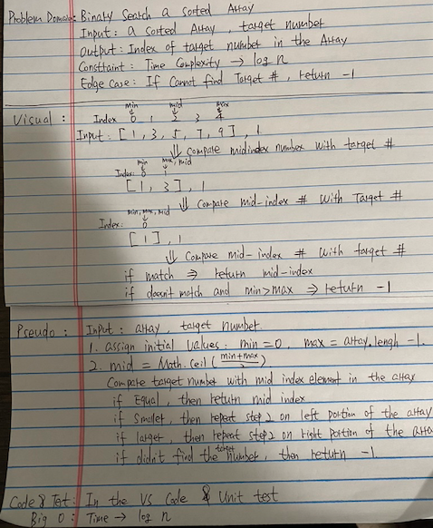
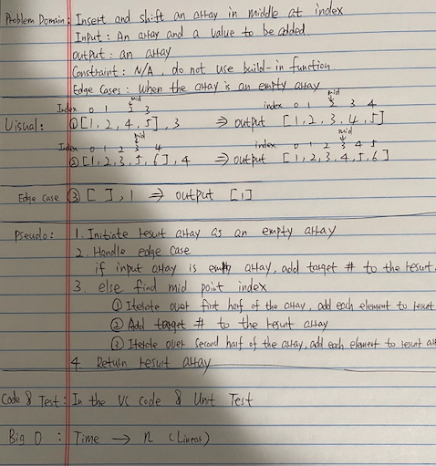
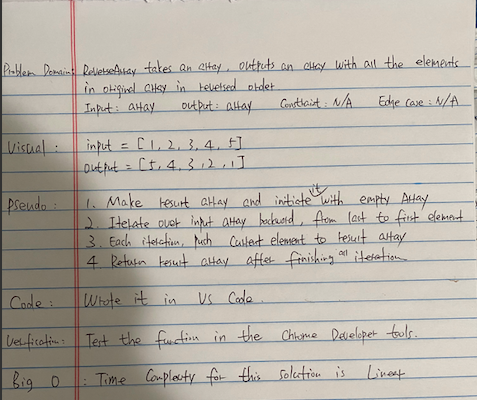

# data-structures-and-algorithms

## nth Fibonacci number (2 ways) - 4/16/2020
Generate the nth Fibonacci number in two different ways. This function takes a non-negative integer as input and output an integer

  ### Challege Description
  Solve the problem in two different ways in 20 minutes.

  ### Approach & Efficiency
  * Approach1: Iterative method
    * Initialize result array with [0, 1].
    * Iterate over index from 2 to given input n. For each iteration, result[ i ] = result[i - 1] + result[i - 2].
    * Return result[ n ] after finish iteration.
  * Apporach2: recursive method
    * For given input n, if n is equal to 0, then return 0. If n is equal to 1, then return1. If n is larger than 1, then return f(n-1) + f(n-2).
    * Time complexity of iterative method is n (Linear).
    * Test: Run command 'jest __tests__/nth-fibonacci.test.js' from root directory.

  ### Solution
   

## Array Binary Search - 4/15/2020
Binary search a sorted array. This function takes a sorted array and a target number. If traget number exist, then return the index of target number in the arry. If not, then return -1.

  ### Challenge Description
  Implement binary search to achieve log n time complexity.

  ### Approach & Efficiency
  * Approach: 
    * Compare target number with mid index element in the input array. 
    * If they are equal, then return the current mid index. 
    * If target number is smaller than mid index number, then binary search only left portion of the array. 
    * If target number is larger than mid index number, then binary search only right portion of the array. 
    * If didn't find the target number, then return -1.
  * Time complexity of this approach is log n.
  * Test: Run command 'jest __tests__/array-binary-search.test.js' from root directory.

  ### Solution
   

## Insert and shift an array in middle at index - 4/14/2020
Function insertShiftArray takes an array and a value to be added. It adds value into the array in middle at index and outpus a new array.

  ### Challenge Description
  Find a formular to get mid index for insert point that works both on even and odd length array.

  ### Approach & Efficiency
  * Approach: 
    * Find the mid index for insert point in the array. 
    * Iterate over first half of the array and add each element to the result array.
    * Add the value to the result array.
    * Iterate over second half of the array and add each element ot the result array.
    * return the result array.
  * Time complexity of this approach is n (linear).
  * Test: Run command 'jest __tests__/array-shift.test.js' from root directory.

  ### Solution
   

## Reverse an Array - 4/13/2020
Function reverseArray takes an array as an argument and it outputs an array with all the elements in original array in reversed order.

  ### Solution
  