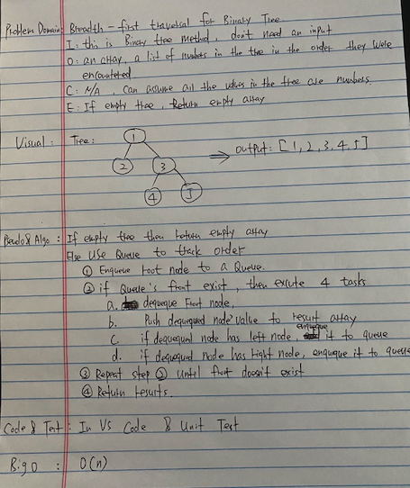
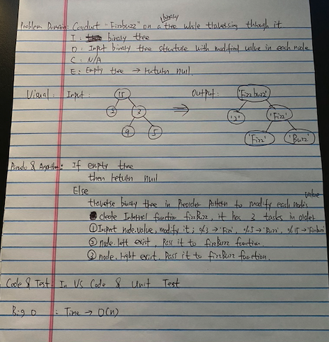

# data-structures-and-algorithms

## First Repeated Word - 5/26/2020  
Find the first repeated word in a book. Write a function that takes a string as input and return first repeated word in the input.  

  ### Challenge Description 
  This code challenge is not hard. I just needed to see regular expression reference for the syntax and method. 

  ### Approach & Efficiency 
  * Approach: 
    1. Handle edge cases first. If the input is not string, then return null. If the input is empty string, then return `no repeated word`. 
    2. If the input is string and not empty, then split input by words and store them in an array.  
    3. Iterate over the array, check if the current word appears in an array that sliced from next index to the end in the original array.  
      * If appears, then return current word.
      * Else, return `no repeated word`.  
  * Time complexity: O(n) since it iterates over an array.
  * Test: Run command `jest __tests__/repeated-word.test.js --verbose --coverage` from the root directory.  

  ### Solution
   

## Breadth First Search - 5/5/2020
Breadth first search a binary tree. It searches a binary tree from top level to bottom level from left to right. Return a list of the values in the tree in the order they were encountered.

  ### Challenge Description
  The prompt confused me. It wants me to extend the binary tree class by adding bfs method. This method should not take any input just like preorder, inorder, and postorder method. But in prompt, it is said the method takes a tree as input. 

  ### Approach & Efficiency
  * Approach:
    * If empty tree then return empty array.
    * Else use Queue to track the order.
      1. Enqueque root node to a Queue.
      2. If queue's front exist, then excute 4 tasks.
          * Dequeque front node.
          * push dequequed node's value to results array.
          * If dequequed node has left node, then enqueque it to the Queue.
          * If dequequed node has right node, then enqueque it to the Queue.
      3. Repeat step 2 until front doesn't exist.
      4. Return results array.
  * Time Complexity: O(n) since it needs to search the whole tree.
  * Test: Run command `jest __tests__/breadth-first.test.js` from root directory.

  ### Solution
   

## FizzBuzz Tree - 5/4/2020
Conduct 'FizzBuzz' on a binary tree while traversing through it.
* If the value is divisible by 3, replace the value with “Fizz”
* If the value is divisible by 5, replace the value with “Buzz”
* If the value is divisible by 3 and 5, replace the value with “FizzBuzz”
* If the value is not divisible by 3 or 5, simply turn the number into a String.

  ### Challenge Description
  The prompt doesn't give clear instruction. It is said conduct 'FizzBuzz' on a tree not a binary tree. The tree I implemented in previous code challenge was binary tree, so I am going to conduct 'FizzBuzz' on a binary tree in this code challenge. The instruction 'create a new tree' confused me in the beginning since I thought I need to copy the original tree and then apply 'FizzBuzz' on a new tree and return new tree.

  ### Approach & Efficiency
  * Approach:
    * if empty tree then return null.
    * else traverse binary tree in preorder search pattern and modify each node's value properly. Create internal function fizzBuzz, it has three tasks in order.
      1. inspect node.value and modify it properly based on the 'FizzBuzz' rule.
      2. if node.left exists, pass it to fizzBuzz function.
      3. if node.right exists, pass it to fizzBuzz function.
    * return the tree.
  * Time Complexity: O(n) because it needs to search the whole tree.
  * Test: Run command `jest __tests__/fizz-buzz-tree.test.js --verbose` from root directory.

  ### Solution
   

## Binary Tree - 5/3/2020
Implement Binary Tree data structure. Write preOrder, inOrder, and postOrder methods for Binary Tree.

  ### Challenge Description
  Tree is not linear data structre such as arrays or linked lists. Use recursive way to traverse from root node to last node is challenge for me.

  ### Approach & Efficiency
  * Approach:
    * Preorder: root -> left -> right
      1. create a _walk function, it needs to do three tasks in order.
      2. push current node's value to results array.
      3. if current node has left child, then pass left child node to _walk function.
      4. if current node has right child, then pass right node to _walk function.
      5. At last, return results array.
    * Inorder: left -> root -> right
      1. create a _walk function, it needs to do three tasks in order.
      2. if current node has left child, then pass left child node to _walk function.
      3. push current node's value to results array.
      4. if current node has right child, then pass right node to _walk function.
      5. At last, return results array.
    * Postorder: left -> right -> root
      1. create a _walk function, it needs to do three tasks in order.
      2. if current node has left child, then pass left child node to _walk function.
      3. if current node has right child, then pass right node to _walk function.
      4. push current node's value to results array.
      5. At last, return results array.
  * Test: run command `jest __tests__/tree.test.js --verbose --coverage` from root directory.

  ### Methods
  1. preOrder method: start from root node and traverse node in root -> left -> right order and store each node's value in an array and return the array.
  2. inOrder method: start from most left branch and traverse node in left -> root -> right order and store each node's value in an array and return the array.
  3. postOrder method: start from most left branch and traverse node in left -> right -> root order and store each node's value in an array and return the array.

## Stack and Queue - 4/26/2020
Implement Stack and Queue data structures by using Linked List. Write push, pop, peek, and isEmpty methods for Stack and write enqueque, dequeque, peek, and isEmpty method for Queue.

  ### Challenge Description
  Implement Stack and Queue by using Linked List not Array.

  ### Approach & Efficiency
  * Approach:
    * Stack: has top property and initial value is null.
      1. push method: If it is empty Stack, then points top at new node. If it is not empty Stack, then new node's next points at current top and then make top points at new node. Time Complexity: O(1).
      2. pop method: If it is empty Stack, then return null. If it is not empty Stack, then return top's value and make top points at top's next node. Time Complexity: O(1).
      3. peek method: If it is empty Stack, then return null. If it is not empty Stack, then return top's value. Time Complexity: O(1).
      4. isEmpty method: If top is null, then return true, else return false. Time Complexity: O(1).
    * Queue: has front and rear properties and both initial values are null.
      1. enqueque method: If it is empty Queue, then points both front and rear at new node. If it is not empty Queue, then rear's next points at new node and then make rear point at new node. Time Complexity: O(1).
      2. dequeque method: If it is empty Queue, then return null. If it is not empty Queue, then return front's value and make front points at front's next node. Time Complexity: O(1).
      3. peek method: If it is empty Queue, then return null. If it is not empty Queue, then return front's value. Time Complexity: O(1).
      4. isEmpty method: If front is null, then return true, else return false. Time Complexity: O(1).
  * Test: Run command `jest __tests__/stack-and-queue.test.js --verbose --coverage` from root directory. Test coverage is 100%.

  ### Methods
  * Stack: FILO
    1. push method: Add a node and make it top. Time complexity is O(1).
    2. pop method: Delete the top node and return its value. If it is empty Stack, then return null. Time complexity is O(1).
    3. peek method: Return top node's value. If it is empty Stack, then return null. Time complexity is O(1).
    4. isEmpty method: Return true if it is Empty Stack, return false if it is not. Time complexity is O(1).
  * Queue: FIFO
    1. enqueue method: Add a node in the rear. Time complexity is O(1).
    2. dequeue method: Delete the front node and return its value. If it is empty Queue, then return null. Time complexity is O(1).
    3. peek method: Return front node's value. If it is empty Queue, then return null. Time complexity is O(1).
    4. isEmpty method: Return true if it is empty Queue, return false if it is not. Time complexity is O(1).

## Reverse a linked list - 4/23/2020
Write a function that would reverse a given linked list. Do not use build-in method.

  ### Challenge Description
  Find a in-place solution without copy input linked list.

  ### Approach & Efficiency
  * Approach:
    * Traversing over the linked list and storing a reference to a current node, its previous node, and its next node.
    * In every iteration, after the next node is stored, the current’s node next pointer is pointed at the stored reference to the previous node. 
  * Time Complexity: O(n).
  * Test: Run command `jest __tests__/reverseLL.test.js  --verbose --coverage` from root directory.

  ### Solution
   

## k-th value from the end of the linked list - 4/21/2020
Implement Singly Linked List and its append and kthFromEnd method. Write unit test for all methods.

  ### Challenge Description
  Find k-th value from the end of the linked list not from start of the linked list. Since linked list is uni-directional so we can only traverse linked list from head to last node. I need to find a way to record each node's value in reverse order.

  ### Approach & Efficiency
  * Approach:
    * Handle edge case. if k < 0, then return 'Exception'.
    * Traverse LL from head to last node.
    * unshifit current node's value to a temp array(initially empty) in each iteration.
    * After finish traversing, if k < temp.length then return temp[ k ], else return 'Exception'.
  * Time Complexity: O(n).
  * Test: Run command `jest __tests__/ll-kth-from-end.test.js --verbose --coverage` from root directory.

  ### Solution
   

## Linked List insertions - 4/20/2020
Implement Singly Linked List and its append, insertBefore, and insertAfter method. Write unit test for all methods.

  ### Challenge Description
  Handle the edge cases. Make sure insertBefore could add a node before head and insertAfter could add a node after last node.

  ### Approach & Efficiency
  * Approach:
    * Create Node class with value and next property.
    * Create Linked List class with head property.
    * append method: If it is empty Linked list then assign new node to head. If not, traverse to the last node and add new node to last node.
    * insertBefore method: Traverse the linked list from head to last node and check if current node's value is equal to target value. If eqaul and if current node is head then make new node points at current node and make new node head. If equal and if current node is not head then make previous node points at new node and new node points at current node. If current node value is not equal to target value then move to the next node and do the above step.
    * insertAfter method: Traverse the linked list from head to last node and check if current node's value is equal to target value. If equal and if current node is last node then make current node points at new node. If equal and if current node is not last node then make current node points at new node and new node points at next node. If current node value is not equal to target value then move to next node and do the above step.
  * Time Complexity: 
    * append method: O(n)
    * insertBefore method: O(n)
    * insertAfter method: O(n)
  * Test: Run command `jest __tests__/ll-insertions.test.js` from root directory.

  ### Solution
   

## Singly Linked List - 4/19/2020
Implement Singly Linked List and its append, insert, includes, toString method

  ### Challenge Description
  Write unit test for all methods I created.

  ### Approach & Efficiency
  * Approach:
  I created Node and Linked List class first and then created append method. I used while loop to traverse linked list and using traversing and append method to build result of the method.
  * Time Complexity:
    * append method: O(n)
    * insert method: O(1)
    * includes method: O(n)
    * toString method: O(n)
  * Test: Run command `jest __tests__/linked-list.test.js` from root directory.

  ### Linked List Methods
  * append(value): add a node to the end of the linked list
  * insert(value): insert a new head to the linked list
  * includes(value): inspect if the value exists in the linked list
  * toString(): returns a string that representing all the values in the linked list, formatted as: '{ 1 } -> { 2 } -> { 3 } -> NULL'.

## nth Fibonacci number (2 ways) - 4/16/2020
Generate the nth Fibonacci number in two different ways. This function takes a non-negative integer as input and output an integer

  ### Challenge Description
  Solve the problem in two different ways in 20 minutes.

  ### Approach & Efficiency
  * Approach1: Iterative method
    * Initialize result array with [0, 1].
    * Iterate over index from 2 to given input n. For each iteration, result[ i ] = result[i - 1] + result[i - 2].
    * Return result[ n ] after finish iteration.
  * Apporach2: recursive method
    * For given input n, if n is equal to 0, then return 0. If n is equal to 1, then return1. If n is larger than 1, then return f(n-1) + f(n-2).
  * Time complexity of iterative method is n (Linear).
  * Test: Run command `jest __tests__/nth-fibonacci.test.js` from root directory.

  ### Solution
   

## Array Binary Search - 4/15/2020
Binary search a sorted array. This function takes a sorted array and a target number. If traget number exist, then return the index of target number in the arry. If not, then return -1.

  ### Challenge Description
  Implement binary search to achieve log n time complexity.

  ### Approach & Efficiency
  * Approach: 
    * Compare target number with mid index element in the input array. 
    * If they are equal, then return the current mid index. 
    * If target number is smaller than mid index number, then binary search only left portion of the array. 
    * If target number is larger than mid index number, then binary search only right portion of the array. 
    * If didn't find the target number, then return -1.
  * Time complexity of this approach is log n.
  * Test: Run command `jest __tests__/array-binary-search.test.js` from root directory.

  ### Solution
   

## Insert and shift an array in middle at index - 4/14/2020
Function insertShiftArray takes an array and a value to be added. It adds value into the array in middle at index and outpus a new array.

  ### Challenge Description
  Find a formular to get mid index for insert point that works both on even and odd length array.

  ### Approach & Efficiency
  * Approach: 
    * Find the mid index for insert point in the array. 
    * Iterate over first half of the array and add each element to the result array.
    * Add the value to the result array.
    * Iterate over second half of the array and add each element ot the result array.
    * return the result array.
  * Time complexity of this approach is n (linear).
  * Test: Run command `jest __tests__/array-shift.test.js` from root directory.

  ### Solution
   

## Reverse an Array - 4/13/2020
Function reverseArray takes an array as an argument and it outputs an array with all the elements in original array in reversed order.

  ### Solution
  